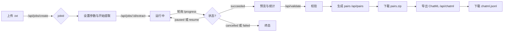

# Text2Dialog 开发者指南

> **定位**：Text2Dialog 是一个将长文本（如小说、剧本）自动抽取为结构化“角色对话 + 引用关系”的基础设施，内置可视化前端与 FastAPI 服务，并配套校验、配对、导出 ChatML 数据集的完整流水线。本指南面向专业开发者，帮助你高效使用、深度定制与二次开发。

---

## 0. 快速总览

- **核心能力**
  - 按 Token 上限**分块**长文本，带**重叠上下文**（COVER_CONTENT），避免切断语义。
  - 通过兼容 OpenAI 的 SDK 调用多家 LLM 平台，抽取形如 `[{role, dialogue, reply}]` 的脚本式结构。
  - **reply** 字段指向同一 chunk 内**更早**的发言（`target_index`），要求**跨说话人**、可配置**置信度阈值**与**回溯窗口**。
  - **并发**抽取、**断点续跑**、**可暂停/取消**、**进度/ETA**。
  - 产出 **JSONL**，配套**严格校验器**、**角色对配对**（A→B / B→A）与 **ChatML 导出**（支持 pair / stitch 多轮拼接）。

- **如何开始**
  - 图形化：`python launcher.py` 一键创建虚拟环境、安装依赖、启动服务与前端。
  - 服务端：`pip install -r text2dialog/requirements.txt` → `uvicorn server:app --host 0.0.0.0 --port 8000`
  - 命令行：`python text2dialog/dialogue_chain.py input.txt -o out.jsonl --concurrent -t 8`

---

## 1. 目录结构与关键模块

```
Text2Dialog/
├─ README.md                   # 项目说明与快速开始
├─ 帮助文档.html                # 面向非技术用户的操作指南（可在 launcher 中“打开帮助”直链此文件）
├─ Text2Dialog_开发者指南.md    # 开发者指南（本文档）
├─ launcher.py                 # Tk GUI 启动器：创建虚拟环境、安装依赖、运行/停止服务器、打开UI/文档
├─ run_server.(sh|bat)         # 便捷脚本：启动 uvicorn
└─ text2dialog/
   ├─ server.py                # FastAPI 服务：作业管理、抽取流程、校验/配对/导出、静态前端
   ├─ dialogue_chain.py        # 核心对话抽取管线（分块/并发/重试/校验/进度/续跑/控制）
   ├─ config.py                # 全局配置与平台抽象（平台环境变量、默认模型、提示词模板、schema等）
   ├─ validate_output.py       # JSONL 输出严格校验（结构、索引、reply 合法性、置信度范围）
   ├─ pair_dataset_builder.py  # 从 JSONL 构建有向角色对样本（A→B），含过滤/严格模式
   ├─ pair_to_chatml.py        # 将配对样本转为 ChatML（pair 或 stitch 多轮）
   └─ static/                  # 前端静态资源（index.html / app.js / style.css）
```

---

## 2. 安装与运行

### 2.1 环境需求
- Python 3.9+（推荐 3.10–3.12）
- 可联网访问所选 LLM 平台

### 2.2 一键启动（GUI）
```bash
cd Text2Dialog
python launcher.py
```
- 按提示“一键配置/修复环境”，安装 `text2dialog/requirements.txt`
- “启动服务”后点击“打开界面”进入前端控制台
- 可在“保存 API 配置(.env)”中写入平台密钥

### 2.3 直接启动服务（CLI）
```bash
cd Text2Dialog/text2dialog
pip install -r requirements.txt  # openai, tiktoken, fastapi, uvicorn, ...
uvicorn server:app --host 0.0.0.0 --port 8000
```
浏览器访问 `http://localhost:8000`（由 `server.py` 提供静态前端）。

### 2.4 纯命令行抽取
```bash
python text2dialog/dialogue_chain.py input.txt -o extraction.jsonl --concurrent -t 8 --reply-window 6
# 完成后可排序与统计：
#   --sort-output   按 chunk_id 排序写回
#   --stats         打印角色分布、平均长度、chunk 数等
```

---

## 3. 多平台接入与配置

`config.py` 抽象了平台与默认参数，**平台选择**由 `LLM_PLATFORM` 环境变量决定，`.env` 示例见 `env.example`。内置平台（名称 → 说明）：

- `deepseek`（DeepSeek 官方）
- `siliconflow`（硅基流动）
- `bailian`（阿里云百炼 / 通义千问兼容模式）
- `moonshot`（Kimi）
- `openai`（OpenAI 官方）
- `gemini`（Google Gemini / OpenAI 兼容入口）
- `aws_bedrock`（Amazon Bedrock / OpenAI 兼容入口）
- `custom`（自定义 base_url 与模型）

关键环境变量（每个平台不同）：
- `*_API_KEY`：API 密钥
- `*_BASE_URL`：OpenAI 兼容 base url
- `*_MODEL_NAME`：默认模型名称
- `LLM_PLATFORM`：当前平台名（如 `siliconflow`）

> 前端 UI 也支持**临时覆盖**：平台、API Key、Base URL、模型名均可通过一次性请求传入，不污染全局环境。

---

## 4. 抽取流程与算法细节

### 4.1 分块策略（Chunking）
- 使用 `tiktoken`（默认 `cl100k_base`）估算 Token。
- 参数：
  - `MAX_TOKEN_LEN`（默认 1000）：单块最大 token。
  - `COVER_CONTENT`（默认 100）：跨块**token 级重叠**，保留上下文。
- 处理：
  - 逐行拼接，超限时对**长行**按句号/问号/感叹号切分。
  - 清理空行、多余空白。
  - 记录 `chunk_id`（从 0 自增）。

### 4.2 模型调用与适配
- SDK：`openai` 兼容接口。
- 优先尝试 **OpenAI Responses API**（当平台/模型像 `gpt-5/o3/o4/gpt-4.1/gpt-4o` 且可用时），否则回退到 **Chat Completions**。
- 支持 `TEMPERATURE`、`MAX_RETRIES`、`RETRY_DELAY`、（可选）`REASONING_EFFORT` 等。
- 统一生成 `system_prompt`（内嵌 TypeScript 风格 schema + 示例），`user_prompt` 为当前 chunk 文本。
- 自动剥离推理型模型输出中的“思考/推理”前缀，仅保留 JSON 有效载荷。

### 4.3 输出结构（核心 schema）
每条抽取结果（**JSONL 每行一条**）：
```json
{
  "chunk_id": 12,
  "dialogue_index": 3,
  "role": "张三",
  "dialogue": "我到了。",
  "reply": {
    "target_index": 2,
    "target_role": "李四",
    "confidence": 0.91
  },
  "chunk_text": "...（可选，取决于是否开启保存）"
}
```
- `dialogue_index`：当前 chunk 内 0-based 顺序。
- `reply`：
  - **必须**指向**更早**的索引（同一 chunk 内）。
  - **必须**跨说话人（`target_role != role`）。
  - **回溯窗口**：`REPLY_WINDOW`（默认 6 条内）。
  - **置信度阈值**：`REPLY_CONFIDENCE_TH`（默认 0.65，低于则置 `null`）。
- 可选 `chunk_text` 由 `SAVE_CHUNK_TEXT` 控制。

### 4.4 并发、进度与断点续跑
- 并发：`ThreadPoolExecutor` 按 chunk 并发处理；**有序写回**（内部缓冲 `results_buffer` + `next_expected_chunk_id`），避免乱序。
- 进度：`.cache/progress.json` 持续写入：
  - `processed_chunks / total_chunks / stage / message / speed_cps / eta_sec / timestamp`。
- 续跑：启动时**优先读取进度**；若异常则**扫描已有输出**的 `chunk_id` 集合，以首个缺失位置续写。

### 4.5 运行时控制（暂停/继续/取消）
- 控制文件：`.cache/control.json`，状态 `running | paused | cancelling`。
- 服务端提供 `/api/jobs/{id}/control`，前端按钮直接操作：
  - `pause`：处理循环等待，保持状态。
  - `resume`：继续处理。
  - `cancel` / `force-cancel`：抛出 `CancelledError`，优雅收尾。

---

## 5. 服务端 API（FastAPI）

> 统一前缀：`/api`。资源目录：`${APP_ROOT}/jobs/{job_id}`，包含 `input.txt`、`.cache/`、`extraction.jsonl`、`pair_datasets/`、`chatml.jsonl` 等。

### 5.1 作业生命周期
- `POST /api/jobs/create`  
  表单字段：`file`（上传原始 `.txt`）。  
  返回：`{ "job_id": "xxxx" }`
- `POST /api/jobs/{job_id}/extract`（请求体 `ExtractReq`）
  ```json
  {
    "platform": "openai|deepseek|...|custom",
    "api_key": "sk-...",
    "base_url": "https://.../v1",
    "model_name": "gpt-4o-mini",
    "concurrent": true,
    "threads": 8,
    "save_chunk_text": false,
    "sort_output": false,
    "MAX_TOKEN_LEN": 1000,
    "COVER_CONTENT": 100,
    "TEMPERATURE": 0.6,
    "REPLY_WINDOW": 6,
    "REPLY_CONFIDENCE_TH": 0.65
  }
  ```
  返回：`{ "ok": true, "pid": 12345 }`
- `GET /api/jobs/{job_id}/progress`  
  返回：`{ "progress": {...}, "status": "running|paused|cancelling|succeeded|failed|done", "message": "..." }`
- `POST /api/jobs/{job_id}/control`  
  体：`{ "action": "pause|resume|cancel|force-cancel", "reason": "..." }`

### 5.2 校验/配对/导出
- `POST /api/validate`（`ValidateReq`）  
  体：`{ "job_id": "...", "input_path": "可选，默认用上一步 extraction.jsonl" }`  
  返回：`{ "ok": true|false, "log": "stderr 输出" }`
- `POST /api/pairs`（`PairBuildReq`）  
  体（关键字段）：
  ```json
  {
    "job_id": "...",
    "input_path": "可选，默认 extraction.jsonl 或 validated",
    "out_dir": "可选，默认 jobs/{id}/pair_datasets",
    "merge_out": "可选，将所有 pair 合并到该 JSONL",
    "pairs": ["张三,李四", "李四,王五"],   // 显式指定有序对
    "roles": ["张三","李四","王五"],       // 与 all_ordered_pairs 搭配
    "all_ordered_pairs": true,             // roles 全排列（去自反）
    "min_confidence": 0.8,
    "require_confidence": false,
    "strict": true,                        // 严格模式（默认开启）
    "min_src_chars": 1, "max_src_chars": null,
    "min_reply_chars": 1, "max_reply_chars": null,
    "deny_pattern": ["\\b广告\\b", "http://"]
  }
  ```
  返回：`{ "ok": true, "out_dir": ".../pair_datasets", "zip": ".../pairs.zip" }`
- `POST /api/chatml`（`ChatMLReq`）  
  体（关键字段）：
  ```json
  {
    "job_id": "...",
    "input": "可选，默认 jobs/{id}/pair_datasets",
    "out": "可选，默认 jobs/{id}/chatml.jsonl",
    "mode": "pair|stitch",
    "min_confidence": 0.8,
    "reverse": false,
    "include_meta": false
  }
  ```
  返回：`{ "ok": true, "out": ".../chatml.jsonl" }`
- 下载：
  - `GET /api/jobs/{job_id}/download?which=extraction|pairs_zip|chatml`

> **注意**：`/api/chatml` 的 `mode` 取值应为 `"pair"` 或 `"stitch"`（前端已正确传递）。如果以程序方式调用，请保持一致。

---

## 6. 校验与数据集构建

### 6.1 JSONL 校验（validate_output.py）
- 检查每行对象：
  - `chunk_id / dialogue_index` 非负整数、chunk 内不重复。
  - `role / dialogue` 为非空字符串。
  - `reply` 为 `null` 或对象；若为对象：  
    - `target_index` 必须在合法范围内（同 chunk，且**早于**当前索引）。  
    - `target_role` 若存在必须为字符串。  
    - `confidence` 必须为 `[0,1]` 区间**有限数值**。
- 典型用法：
  ```bash
  python text2dialog/validate_output.py extraction.jsonl
  # 以返回码标识通过/失败，并打印详细错误行
  ```

### 6.2 角色对配对（pair_dataset_builder.py）
- 目标：从校验通过的 JSONL 中抽出**有向**样本 `A → B`。
- **严格模式**（默认）：
  - 仅保留模型明确标注为 `A 回复 B` 的样本。
  - 当 `target_role` 与配对不一致**直接丢弃**（不做回退猜测）。
- 非严格模式：
  - 当缺失或不一致时，可选择**回退**到启发式（以 `target_index` 的角色为准）。
- 置信度与文本合法性过滤：
  - `--min-confidence`（默认 0.8），`--require-confidence`（无置信度也丢弃）。
  - 文本长度上下限与**黑名单正则**（对源与回复分别生效）。
- 输出格式（每行一条）：
```json
{
  "source": {"chunk_id": 12, "dialogue_index": 2, "role": "李四", "text": "你在哪？"},
  "reply":  {"chunk_id": 12, "dialogue_index": 3, "role": "张三", "text": "我到了。"},
  "pair":   {"from": "李四", "to": "张三"},
  "confidence": 0.91
}
```

### 6.3 ChatML 导出（pair_to_chatml.py）
- 两种模式：
  - **pair**：每条样本 = 一轮对话（默认 `source → user`, `reply → assistant`；可 `--reverse`）。
  - **stitch**：在**同一 chunk**、**同一无序角色对 {A,B}** 内，按索引连续拼接成多轮会话（`--max-turns` 限制最大轮数）。
- 支持：
  - `--min-confidence`、`--dedupe`（按 `source.text`+`reply.text` 去重）。
  - 可注入系统消息：`--system "文本"` 或 `--system-template "来自 {from_role} 给 {to_role}"`。  
    模板可使用 `{from_role}/{to_role}/{src_role}/{tgt_role}` 占位。
- 输出（每行一条 ChatML）：
```json
{
  "messages": [
    {"role": "system", "content": "生成对输入内容的回复。"},
    {"role": "user", "content": "你在哪？"},
    {"role": "assistant", "content": "我到了。"}
  ]
  // include_meta=true 时附带 meta
}
```

---

## 7. 前端操作台

### 7.1 本地运行与联调

- 前端位于 `text2dialog/static/`（`index.html / app.js / style.css`），由 FastAPI 直接提供静态资源。
- 推荐联调步骤：
  ```bash
  # 安装依赖并启动服务
  pip install -r text2dialog/requirements.txt
  uvicorn text2dialog.server:app --host 0.0.0.0 --port 8000

  # 浏览器访问
  http://localhost:8000
  ```
- 前端所有 API 调用使用 **同源相对路径**（如 `/api/jobs/{id}/progress`）。  
  如需前后端分离部署，请在网关将 `/api/*` 转发到 FastAPI；或在 `app.js` 的 `api()` 中增加可配置的后端基址与 CORS 支持。

### 7.2 页面结构与主流程

界面围绕一个作业（Job）完成从上传到导出的五步主流程：

1. **上传文本**：拖拽或选择 `.txt`，创建作业 `job_id`。  
2. **运行设置**：选择平台/模型，配置抽取参数（并发、温度、Token 上限、回溯窗口等）。  
3. **开始提取**：后端执行抽取，前端**轮询进度**并展示 ETA。  
4. **校验与预览**：触发输出校验，预览前若干条结果与**角色分布统计**。  
5. **构建数据集并导出**：生成**角色有向对**（pairs），再导出 **ChatML**（`pair`/`stitch` 两种模式）。

控件与状态区：
- 运行控制：`开始提取（run）`、`暂停（pause）`、`继续（resume）`、`取消（cancel）`  
- 进度：原生 `<progress>`（`#bar`）+ 状态文本（`#status`）

### 7.3 DOM 锚点（关键控件 ID）

**基础设置**
- `#platform`（平台） · `#modelName`（模型名，可空） · `#baseUrl`（API Base URL，可空） · `#apiKey`（API Key）

**高级参数（`<details>` 折叠）**
- `#concurrent`（并发开关） · `#threads`（线程数）
- `#temperature` · `#maxTokenLen` · `#coverContent`
- `#saveChunkText`（保存 chunk 原文） · `#sortOutput`（按 `chunk_id` 排序写回）
- `#replyWindow`（回溯窗口） · `#replyConf`（置信度阈值）

**校验/预览**
- `#validate`（执行校验） · `#validateLog`（校验日志） · `#downloadExtract`（下载抽取结果）
- `#preview`（预览前若干条）
- 统计：`#statsCard`、`#statTotal`、`#statRoles`、`#statAvg`、`#roleBars`、`#toggleRoles`

**配对与导出**
- `#pairs`（手动指定角色对；留空=全集有序对） · `#minConfidence` · `#strict` · `#requireConf`
- `#downloadPairs`（下载 `pairs.zip`）
- `#mode`（`pair|stitch`） · `#maxTurns` · `#chatmlMinConf` · `#dedupe` · `#reverse` · `#systemText`
- `#buildChatML`、`#downloadChatML`

**控制与主题**
- `#run`、`#pause`、`#resume`、`#cancel` · 进度 `#bar` 与 `#status`
- 主题：`#themeSelect`（`localStorage['t2d-theme'] = "dark" | "light-doc"`）

### 7.4 `app.js` 架构与关键流程

- 采用顶层 IIFE 与少量工具函数（`$()`、`api()`）组织代码；避免全局变量污染。
- **核心状态**：`jobId`、`defaults`（从后端拉取的默认参数）、`pollTimer`（进度轮询）。
- **关键函数**
  - `init()`：初始化 UI，`GET /api/defaults` 拉取平台列表与默认参数（若提供），设置初始禁用态。
  - `upload(file)`：`POST /api/jobs/create` 创建作业；成功后启用“开始提取”。
  - `run()`：收集表单参数并 `POST /api/jobs/{jobId}/extract`；置为“运行中”并启动 `poll()`。
  - `control(action)`：`POST /api/jobs/{jobId}/control`（`pause|resume|cancel`）。
  - `poll()`：`GET /api/jobs/{jobId}/progress`，渲染进度与状态；终态时启用校验/下载并加载统计。
  - `validate()`：`POST /api/validate`，输出校验日志。
  - `buildPairs()`：`POST /api/pairs` 生成有向对数据集；成功后可下载。
  - `buildChatML()`：`POST /api/chatml` 导出 ChatML，并启用下载按钮。


### 7.5 状态机与按钮联动

`status ∈ { running, paused, cancelling, cancelled, succeeded, failed, done }`

- `running`：启用“暂停/取消”，禁用“继续”。  
- `paused`：启用“继续/取消”，禁用“暂停”。  
- `cancelling`：禁用全部交互，等待终态。  
- 终态（`cancelled/succeeded/failed/done`）：停止轮询，启用下载与后续步骤。

> 轮询节奏建议 **1200–1500ms**，异常自动退避；终态或明显错误时停止。

### 7.6 样式与主题（`style.css`）

- **设计令牌**：颜色、阴影、圆角、间距均通过 CSS Variables（如 `--bg-0`、`--text`、`--line`、`--radius-*`）管理。
- **布局与组件**：`.container`、`.card`、`.grid.two/.grid.three`、`.button/.primary`、`.dropzone`、`.kpi`。
- **主题切换**：`<html data-theme="dark|light-doc">` + `color-scheme`；滚动条/进度条/焦点环统一覆盖。
- **可访问性**：表单焦点 `:focus` 可见；控件具备禁用与悬停态；上传区域具备语义与 `aria-*` 属性。

### 7.7 前端视角下的 API 契约

> 下列体例基于前端使用的字段集合，需与后端保持一致；若后端调整，请同步更新表单与 `app.js` 的请求体组装。

- `GET /api/defaults` → `{ platforms: Record<string,string>, config: {...} }`（用于初始化平台列表与默认值）
- `POST /api/jobs/create`（`FormData{ file }`）→ `{ job_id }`
- `POST /api/jobs/{job_id}/extract`  
  典型请求体字段：
  ```json
  {
    "platform": "openai|deepseek|...|custom",
    "api_key": "sk-...",
    "base_url": "https://.../v1",
    "model_name": "gpt-4o-mini",
    "concurrent": true,
    "threads": 8,
    "save_chunk_text": false,
    "sort_output": false,
    "MAX_TOKEN_LEN": 1000,
    "COVER_CONTENT": 100,
    "TEMPERATURE": 0.6,
    "REPLY_WINDOW": 6,
    "REPLY_CONFIDENCE_TH": 0.65
  }
  ```
- `GET /api/jobs/{job_id}/progress` → `{ status, progress:{ processed,total,eta_sec,stage }, message }`
- `POST /api/jobs/{job_id}/control` → `{ ok: true }`
- `POST /api/validate` → `{ ok, log }`
- `POST /api/pairs` → `{ ok, out_dir, zip }`（支持 `pairs / roles / all_ordered_pairs / min_confidence / require_confidence / strict`）
- `POST /api/chatml` → `{ ok, out }`（`mode: "pair"|"stitch"`, 支持 `reverse / min_confidence / dedupe / system_text`）
- 下载：`GET /api/jobs/{job_id}/download?which=extraction|pairs_zip|chatml`

### 7.8 扩展与二次开发建议

- **新增运行参数**（例：`replyTopK`）  
  1) 在 `index.html` 添加控件与唯一 `id`；2) 在 `run()` 组装请求体；3) 后端数据模型与逻辑新增对应字段。
- **新增统计卡片**：后端在 `stats` 增加指标 → `renderStats(stats)` 渲染并复用 `.kpi`。
- **轮询策略**：按数据量/平台限速调整轮询间隔；`paused/cancelling` 可延长。
- **独立部署**：通过 Nginx/反代将 `/api/*` 透传到后端；或在前端配置可变 `base_url` 与 CORS。

### 7.9 错误处理与常见问题

- **初始化失败（`/api/defaults`）**：确认服务已启动；跨域/路径问题请检查代理配置或 `api()` 基址。
- **上传失败**：检查文件类型与大小限制；查看后端返回与浏览器控制台。
- **控制失效**：`pause/resume/cancel` 后无变化，多为轮询未刷新或状态未落盘；可直接查询 `/api/jobs/{id}`。
- **下载置灰**：需等待阶段产物就绪，并由前端设置 `href`（如 `which=extraction`）。

### 7.10 代码风格与约定

- 使用 ES2015+，小函数化；事件监听在 `DOMContentLoaded` 后统一绑定。
- 以 `#id` 作为绑定锚点；新增控件确保 `id` 唯一。
- 零第三方依赖；如需图表优先使用原生控件/轻量实现。

### 7.11 前端流程示意（Mermaid）



### 7.12 自测清单（建议）

- 上传：拖拽/文件选择、空文件/非法类型提示。  
- 运行：并发/单线程、参数边界（温度/阈值/窗口/Token 上限）。  
- 控制：暂停→继续、取消→终态 UI。  
- 预览：JSON 解析失败的容错（逐条 try/catch）。  
- 统计：Top 角色与“展开全部”的开合。  
- pairs：留空=全集有序对、指定子集、阈值过滤、严格/非严格模式。  
- ChatML：`pair/stitch`、`reverse/dedupe`、`system_text`（文本或模板）。  
- 下载：三个下载按钮在正确阶段可用，文件名与产物一致性校验。

### 7.13 已知可优化点

- `max_turns/dedupe/system_text` 等字段在部分后端版本可能**未消费**；需与后端数据模型对齐。  
- 轮询使用 `setTimeout` 简化实现，可引入退避/抖动与错误重试策略。  
- 未来可拆分为 ES Modules，以提升可维护性与可测试性。

### 7.14 参考（前端相关文件）

- 主页：`text2dialog/static/index.html`  
- 脚本：`text2dialog/static/app.js`  
- 样式：`text2dialog/static/style.css`

## 8. 关键参数与调优建议

- **MAX_TOKEN_LEN**：块越大，模型上下文充足但费用与延迟升高；建议 800–1500。
- **COVER_CONTENT**：重叠越多，跨块引用更稳，但整体 token 较高；建议 50–200。
- **REPLY_WINDOW**：回溯窗口，越大越灵活，误配概率也增；建议 4–8。
- **REPLY_CONFIDENCE_TH**：建议 ≥ 0.6，训练前进一步在 pair 构建处设更高阈值（如 0.8）。
- **并发线程数（threads）**：与平台限速相关，注意 QPS 限制与重试策略（`MAX_RETRIES/RETRY_DELAY`）。
- **温度（TEMPERATURE）**：抽取任务建议偏低（0.2–0.6），减少幻觉与结构漂移。
- **去重（导出阶段）**：SFT 数据建议启用 `--dedupe`，降低数据泄漏与模式崩塌风险。

---

## 9. 项目二次开发指南

### 9.0 场景导览与最佳路径
- **离线批处理**（TB 级语料）：CLI/REST + 并发抽取 + 断点续跑 + 分区落地 → 夜间作业。
- **在线服务**（低延迟 API）：作为库嵌入，限制 `MAX_TOKEN_LEN/threads`，按请求回传 JSON。
- **数据生产线**：Airflow/Prefect → `chunk → extract → validate → pair → export` DAG，产物入湖/入仓。
- **跨语言集成**：部署 FastAPI，按语言封装 SDK（Node/Go/Java），在服务侧做限流与配额。

---

### 9.1 作为库调用（Library Embedding）

#### 9.1.1 配置与依赖注入
```python
from text2dialog.dialogue_chain import DialogueChain
from text2dialog.config import Config

cfg = Config(
    platform="openai",               # 或 deepseek/siliconflow/bailian/moonshot/gemini/aws_bedrock/custom
    api_key="YOUR_API_KEY",
    base_url=None,                   # 可自定义代理网关
    model_name="gpt-4o-mini",
    temperature=0.4,
    max_token_len=1000,
    cover_content=100,
    reply_window=6,
    reply_confidence_th=0.65,
    max_retries=3,
    retry_delay=2.0,
    timeout_sec=120,                 # 若实现支持
)
dc = DialogueChain(config=cfg, max_workers=8, save_chunk_text=False)
```

#### 9.1.2 输入输出抽象（Source/Sink 模式）
为便于定制，将输入/输出抽象为**数据源/数据汇**（Source/Sink）：
```python
from dataclasses import dataclass
from typing import Iterable, Dict, Any
import json, os

@dataclass
class RecordSink:
    def write(self, rec: Dict[str, Any]) -> None: ...
    def close(self): ...

class JSONLSink(RecordSink):
    def __init__(self, path): self.f=open(path,"w",encoding="utf-8")
    def write(self, rec): self.f.write(json.dumps(rec,ensure_ascii=False)+"\n")
    def close(self): self.f.close()

def extract_to_sink(dc, text: str, sink: RecordSink):
    # 若项目暂未暴露对字符串的直接接口，可先写临时文件再调用；或在子类中覆盖 chunk 流程
    for rec in dc.iter_extract(text):     # 假设暴露迭代式 API；若未暴露，参见 9.1.3 包装器
        sink.write(rec)
    sink.close()
```
> 如果 `DialogueChain` 未提供 `iter_extract`，可参照 9.1.3 包装器实现“尾随 JSONL”或继承覆盖内部写回。

#### 9.1.3 在未暴露迭代 API 下的包装器
```python
import tempfile, json, time

def extract_streaming(dc, text: str):
    with tempfile.NamedTemporaryFile("w+", delete=False, encoding="utf-8") as tmp_in:
        tmp_in.write(text); tmp_in.flush()
        out = tmp_in.name+".jsonl"
    dc.extract_dialogues(input_path=tmp_in.name, output_path=out)  # 或 concurrent 版本
    # 边读边推送
    with open(out, "r", encoding="utf-8") as f:
        for line in f:
            yield json.loads(line)

# 用法：
for rec in extract_streaming(dc, "第一章……"):
    # 实时消费 → 入库/消息队列
    pass
```

#### 9.1.4 以库方式串联下游（校验/配对/导出）
```python
from text2dialog import validate_output, pair_dataset_builder, pair_to_chatml

rc = validate_output.main(["extraction.jsonl"])  # 若无 main(args)，参考其内部函数自行调用
assert rc==0

pair_dataset_builder.main([
  "-i","extraction.jsonl","--out","pair_datasets",
  "--min-confidence","0.85","--strict","--require-confidence",
  "--roles","张三","李四","王五","--all-ordered-pairs"
])

pair_to_chatml.main([
  "-i","pair_datasets","-o","chatml.jsonl",
  "--mode","stitch","--max-turns","4","--dedupe",
  "--system-template","你现在扮演 {to_role}，仅围绕文本对话。"
])
```

---

### 9.2 生命周期钩子（Hooks）与可插拔处理

> 通过“钩子”在关键阶段注入自定义逻辑（埋点/特征抽取/缓存/熔断）。若当前版本未直接提供 Hook，可通过**子类化** `DialogueChain` 或在服务层包装。

**建议的 Hook 点（设计参考）**
- `on_chunk_begin(chunk_id, text)` / `on_chunk_end(chunk_id, results)`
- `on_request(payload)` / `on_response(raw)`（可做审计与落盘）
- `on_record(rec)`（逐条抽取结果）
- `on_error(exc, context)`（统一重试/告警）
- `on_progress(stats)`（写入监控系统）

**示例：把每条抽取写入 Kafka**
```python
class KafkaSinkHook:
    def __init__(self, producer, topic): self.p=producer; self.topic=topic
    def on_record(self, rec): self.p.send(self.topic, rec).get(timeout=5)
```

---

### 9.3 自定义 Chunker（剧本/字幕/多语支持）
```python
import re
class ScriptChunker:
    def split_long_line(self, line:str)->list[str]:
        # 优先识别“角色:台词”
        m=re.match(r"^([^\s:：]{1,24})[:：]\s*(.+)$", line)
        if m: return [line]
        return re.split(r"(?<=[。！？\?])", line)

    def chunk_text(self, text:str, max_tokens:int, overlap:int, enc)->list[str]:
        # 参考 DialogueChain 的 token 计数器，将分句结果按 token 包装
        # 伪代码：
        chunks, cur=[], []
        for seg in self.split_long_line(text):
            if enc(seg)+enc("".join(cur))>max_tokens:
                chunks.append("".join(cur))
                cur=[seg]
            else:
                cur.append(seg)
        if cur: chunks.append("".join(cur))
        # 处理 overlap（按 token 回退 overlap 长度）
        return chunks
```
> 将自定义 Chunker 注入 `DialogueChain` 构造或在子类中覆盖 `_chunk_text/_split_long_line`。

---

### 9.4 提示词与 Schema 的工程化管理

- **模板分层**：`base → task → domain` 三层模板，避免在代码里硬编码长 prompt。
- **强约束输出**：在 system prompt 中嵌入**明确的 TypeScript Schema** + **最小示例**。
- **JSON 护栏**：在解析前后做双重校验：
  1. 预解析：剥离非 JSON 片段（如推理痕迹）。
  2. 结构校验：字段完整性、类型、取值范围（参见 `validate_output.py` 规则）。
- **多域共存**：使用 `schema_id` 与 `version`，在输出中附加，便于下游路由与 A/B。

---

### 9.5 LLM 客户端适配与限流

- **超时/重试**：区分连接/读超时；对 429/5xx 做指数退避与抖动。
- **全局 QPS**：令牌桶/漏桶控制；在多进程/多实例下可落 Redis/Etcd 做**分布式限流**。
- **多模型路由**：根据 chunk 长度与复杂度，路由到 fast/accurate 两套模型。
- **请求示例（OpenAI 兼容）**
```python
from openai import OpenAI
client = OpenAI(api_key=cfg.api_key, base_url=cfg.base_url)
resp = client.chat.completions.create(
  model=cfg.model_name,
  messages=[
    {"role":"system","content": "...schema..."},
    {"role":"user","content": chunk_text}
  ],
  temperature=cfg.temperature
)
```
> 若平台支持 Responses API/JSON 模式，优先使用以提升结构化输出稳定性。

---

### 9.6 可靠性：断点续跑、幂等与状态机

- **状态持久化**：`progress.json` + 已写 `chunk_id` 集合 → 计算首个缺失点继续。
- **原子写**：写入临时文件再 rename，避免中断损坏。
- **作业状态机**：`PENDING → RUNNING → PAUSED/CANCELLING → SUCCEEDED/FAILED`；外部仅允许合法迁移。
- **幂等策略**：以 `(job_id, chunk_id, dialogue_index)` 为主键去重；重复请求只回放现有结果。

---

### 9.7 监控、日志与成本度量

- **结构化日志**（JSON）：`job_id, stage, chunk_id, model, latency_ms, input_tokens, output_tokens, cost`。
- **指标**：吞吐（chunks/min）、错误率、P95 延迟、费用占比、置信度分布。
- **示例：标准 logging + JSONFormatter**
```python
import logging, json, sys
class JSONFormatter(logging.Formatter):
    def format(self, record):
        d=record.__dict__.copy()
        d["message"]=record.getMessage()
        return json.dumps({k:d[k] for k in ["levelname","name","message","extra"] if k in d})
logger=logging.getLogger("t2d"); handler=logging.StreamHandler(sys.stdout); handler.setFormatter(JSONFormatter())
logger.addHandler(handler); logger.setLevel(logging.INFO)
logger.info("progress", extra={"extra":{"job_id": "J1","stage":"extract","processed":128}})
```

---

### 9.8 评测与基准（Metrics Harness）

**目标指标**
- `Reply Link Accuracy`：`target_index/target_role` 是否与金标一致。
- `Role F1`：角色识别准确率。
- `Pair Coverage`：在给定 `min_confidence` 下保留下来的样本占比。

**简易评测脚本（示例）**
```python
import json

def load_jsonl(p): 
    with open(p,encoding="utf-8") as f:
        for l in f: yield json.loads(l)

def eval_reply(gold_path, pred_path):
    gold = {(r["chunk_id"], r["dialogue_index"]):(r.get("reply") or {}) for r in load_jsonl(gold_path)}
    hit=tot=0
    for r in load_jsonl(pred_path):
        k=(r["chunk_id"],r["dialogue_index"]); tot+=1
        g=gold.get(k,{}); pr=r.get("reply") or {}
        hit += int(bool(g) and pr.get("target_index")==g.get("target_index") and pr.get("target_role")==g.get("target_role"))
    return {"reply_link_acc": hit/max(1,tot)}
```

---

### 9.9 吞吐与成本优化

- **分块调优**：较小 `MAX_TOKEN_LEN` + 适中 `COVER_CONTENT` 往往在质量-成本间更均衡。
- **微批策略**（仅当你能稳妥解复用）：将多个小 chunk 合成一个请求，在 prompt 中用分隔符编号，模型返回数组；再拆回 → **注意**：需严格校验以防串扰。
- **冷热模型混部**：长 chunk/难样本用强模型，短 chunk/易样本用经济模型（需在线估算复杂度）。
- **缓存**：对重复文本片段做哈希缓存，命中直接复用结果。

---

### 9.10 多租户、配额与预算

- 为每个 `tenant_id` 设置**并发上限/QPS/日预算**，预算耗尽时**软停**（`PAUSED`），并通知上游。
- 费用估算：基于输入/输出 token 统计 + 单价表；周期性落账，便于 FinOps。

---

### 9.11 数据清洗、角色归一化与质量门控

- **角色归一化**：别名词典 + 编辑距离；强制跨说话人约束（`role != target_role`）。
- **内容过滤**：黑名单/白名单正则；去除 URL/脚注/噪声。
- **质量门控**：分级阈值：抽取阶段 `REPLY_CONF_TH`，配对阶段 `--min-confidence`，导出阶段再一次阈值与去重。

---

### 9.12 导出器扩展（beyond ChatML）

**通用导出接口（建议）**
```python
from typing import Iterable, Dict, Any

class Exporter:
    name: str = "custom"
    def export(self, pairs: Iterable[Dict[str,Any]], out_path: str): ...

class AlpacaExporter(Exporter):
    name="alpaca"
    def export(self, pairs, out_path):
        import json
        with open(out_path,"w",encoding="utf-8") as w:
            for rec in pairs:
                ex = {"instruction": rec["source"]["text"], "output": rec["reply"]["text"]}
                w.write(json.dumps(ex,ensure_ascii=False)+"\n")
```
> 将导出器注册到表中：`REGISTER["alpaca"]=AlpacaExporter()`，CLI/REST 通过 `--format alpaca` 选择。

---

### 9.13 与消息队列/数据库集成

- **MQ**：Kafka/RabbitMQ：chunk 任务入队 → 抽取消费者出队处理 → 结果写回 `result` 主题。
- **DB**：PostgreSQL/ClickHouse/SQLite：定义 `extraction`/`pairs` 表，主键 `(job_id, chunk_id, dialogue_index)`。
- **对象存储**：大文件入 S3/OSS，JSONL/ZIP 产物落桶并附带元数据（ETag/版本）。

---

### 9.14 分布式与编排（Ray/Celery/Airflow/Prefect）

- **Ray**：将 `process_chunk` 标注 `@ray.remote(num_cpus=1)`，调度到集群；汇总时按 `chunk_id` 排序写回。
- **Celery**：`extract.delay(job_id, chunk_range)`；失败自动重试；可通过 Redis 锁实现跨 worker 的限流。
- **Airflow/Prefect**：编排跨表的回填/增量任务；用 XCom/Artifacts 存储产物引用。

---

### 9.15 类型与契约（Dataclass / Pydantic）

定义**强类型数据模型**，便于 IDE/测试/序列化：
```python
from dataclasses import dataclass
from typing import Optional

@dataclass
class Reply:
    target_index: int
    target_role: Optional[str]
    confidence: Optional[float]

@dataclass
class DialogueRec:
    chunk_id: int
    dialogue_index: int
    role: str
    dialogue: str
    reply: Optional[Reply] = None
```
> 在导入/导出时统一用 `from_dict/to_dict`，减少 schema 漂移带来的脆弱性。

---

### 9.16 验证器扩展与自定义规则

- 在 `validate_output.py` 中添加你自己的**业务规则**（角色白名单、最大回溯距离、禁用同角色回复等）。
- 支持**警告级**与**错误级**：将“可容忍异常”标记为 Warning 并统计，不中断流水线。

---

### 9.17 包装 CLI 为 Python API （反向亦然）

- 将 CLI `argparse` 解析与实际逻辑解耦：逻辑函数单独定义；CLI 仅做参数解析并调用函数。
- 这样既能作为库复用，又不破坏 CLI 的可用性。

---

### 9.18 单元测试、回归测试与 Fuzz

- **单测**：针对 `_chunk_text/_split_long_line/_parse_and_validate_response` 等关键函数覆盖边界。
- **回归**：固定随机种子/温度=0，确保升级后输出不退化。
- **Fuzz**：随机生成带噪声的输入段落，验证解析稳健性。

---

### 9.19 i18n/多语言与编码注意事项

- 针对 CJK/RTL 文本，优先使用 `cl100k_base` 或等价编码器评估 token；避免按字符长度估算。
- 分句正则需覆盖中英文标点；对 RTL（阿拉伯语/希伯来语）避免基于方向的假设。

---

### 9.20 部署建议（服务模式）

- 生产部署建议：`uvicorn --workers=N --http=h11 --limit-concurrency=...`，前置 Nginx/反向代理。
- 统一**健康检查**：`/healthz` 返回平台连通性/密钥有效性/QPS 窗口剩余。
- 灰度：按 `tenant_id` 或 `job_id` 做路由，逐步放量。

---

## 10. 常见问题（FAQ）

- **模型输出不是纯 JSON？**  
  已内置多种解析路径并剥离推理前缀；仍失败时降低 `TEMPERATURE`、增大示例提示、或切换到 Responses API（如可用）。
- **reply 经常错误或缺失？**  
  调小 `REPLY_WINDOW`、提高 `REPLY_CONFIDENCE_TH`，并在配对阶段设置更高 `--min-confidence`。
- **速率/报错重试频繁？**  
  调整 `MAX_RETRIES/RETRY_DELAY` 与并发度，遵守平台限速。
- **中断/续跑如何保障一致性？**  
  项目在并发模式下**有序写回**，并通过 `progress.json` 与**已写入 chunk 扫描**避免重写冲突。
- **ChatML 导出模式选择？**  
  - `pair`：面向短对齐数据或回复学习。  
  - `stitch`：保留上下文连续性，更适合多轮对话理解任务。  
- **导出接口的 `mode` 值？**  
  程序化调用请传 `"pair"` 或 `"stitch"`（与前端一致）。

---

## 11. 示例工作流（端到端）

1) **上传与抽取**
```bash
# 启动服务后，前端上传 input.txt
# 或命令行：
python text2dialog/dialogue_chain.py input.txt -o extraction.jsonl --concurrent -t 8 --reply-window 6 --stats
```

2) **校验**
```bash
python text2dialog/validate_output.py extraction.jsonl
```

3) **构建有向角色对**
```bash
python text2dialog/pair_dataset_builder.py \
  -i extraction.jsonl --out pair_datasets \
  --roles 张三 李四 王五 --all-ordered-pairs \
  --min-confidence 0.85 --strict --require-confidence
```

4) **导出 ChatML**
```bash
python text2dialog/pair_to_chatml.py \
  -i pair_datasets -o chatml.jsonl \
  --mode stitch --max-turns 4 --dedupe \
  --system-template "你现在扮演 {to_role}，仅围绕文本对话。"
```

---

## 12. 附录：命令行参数速查

### `dialogue_chain.py`
- `input_file`、`-o/--output`
- `--concurrent | --no-concurrent`、`-t/--threads`
- `--reply-window <int>`（默认 6）
- `--reply-confidence-th <float>`（默认 0.65）
- `--save-chunk-text | --no-save-chunk-text`
- `--sort-output | --no-sort-output`
- `-p/--platform`、`-l/--list-platforms`
- `--stats | --no-stats`

### `pair_dataset_builder.py`
- 角色选择：`--pairs "A,B" ...`、`--roles A B ...`、`--all-ordered-pairs`
- 过滤/阈值：`--min-confidence`、`--require-confidence`、`--strict|--no-strict`
- 文本合法性：`--min-src-chars`、`--min-reply-chars`、`--max-src-chars`、`--max-reply-chars`、`--deny-pattern`
- 输出：`-o/--out` 或 `--merge-out`，`--list-roles`

### `pair_to_chatml.py`
- 输入/输出：`-i/--input (文件|目录|glob)`、`-o/--out`
- 模式：`--mode pair|stitch`、`--max-turns <int>`
- 过滤/预处理：`--min-confidence`、`--dedupe`、`--reverse`
- 系统消息：`--system "文本"`、`--system-template "..."`、`--include-meta`

---

### 结语

Text2Dialog 旨在为训练特定语气的LLM提供基础设施。通过标准化的抽取流程、严谨的校验与灵活的导出接口，它可以无缝嵌入你的数据生产线。
