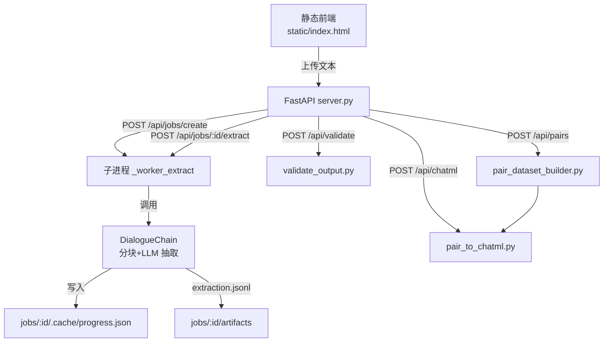
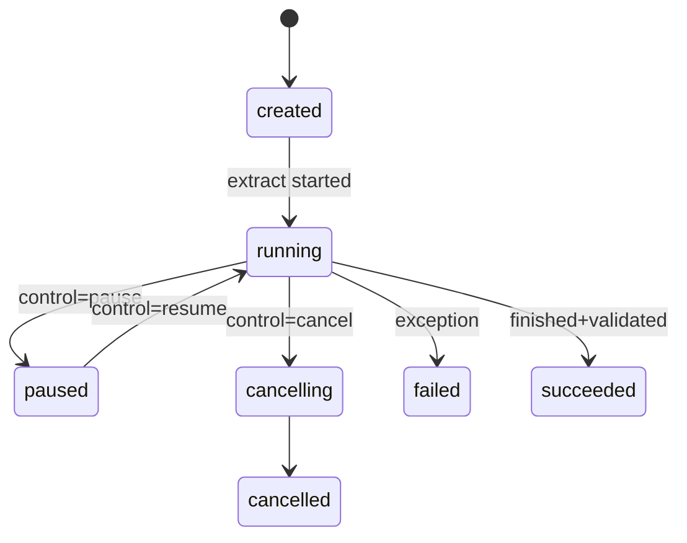

# Text2Dialog 开发者指南

Text2Dialog 是一个将长文本（如小说、剧本）自动抽取为结构化的角色对话的基础设施，内置可视化前端与 FastAPI 服务，并配套校验、配对、导出 ChatML 数据集的完整流水线。

---

## 0. 快速总览

- **核心能力**
  - 按 Token 上限**分块**长文本，带**重叠上下文**（COVER_CONTENT），避免切断语义。
  - 通过兼容 OpenAI 的 SDK 调用多家 LLM 平台，抽取形如 `[{role, dialogue, reply}]` 的脚本式结构。
  - **reply** 字段指向同一 chunk 内**更早**的发言（`target_index`），要求**跨说话人**、可配置**置信度阈值**与**回溯窗口**。
  - **并发**抽取、**断点续跑**、**可暂停/取消**、**进度/ETA**。
  - 产出 **JSONL**，配套**严格校验器**、**角色对配对**（A→B / B→A）与 **ChatML 导出**（支持 pair / stitch 多轮拼接）。

- **如何开始**
  - 图形化：`python launcher.py` 一键创建虚拟环境、安装依赖、启动服务与前端。
  - 服务端：`pip install -r text2dialog/requirements.txt` → `uvicorn server:app --host 0.0.0.0 --port 8000`
  - 命令行：`python text2dialog/dialogue_chain.py input.txt -o out.jsonl --concurrent -t 8`

---

## 1. 架构设计总览
- **分层视角**：接入层（FastAPI + 静态前端，`server.py`） → 业务编排层（作业管理、多进程调度、平台/配置注入） → 对话抽取核心（`dialogue_chain.py`：分块、提示构造、LLM 调用、断点续跑、进度管理） → 数据集加工层（`validate_output.py`、`pair_dataset_builder.py`、`pair_to_chatml.py`） → 持久化层（纯文件系统，`jobs/<job_id>/` 内的输入、产物、缓存、控制标记）。
- **通信边界**：前端与后端经 REST/JSON；抽取作业由 FastAPI 主进程派生子进程（`multiprocessing.Process`）；子进程与主进程通过磁盘文件协同（`job.json`、`.cache/progress.json`、`.cache/control.json`、`.complete`），无外部 MQ/DB。
- **核心数据契约**  
  - 抽取 JSONL：`chunk_id`、`dialogue_index`、`role`、`dialogue`、`reply|null`、可选 `chunk_text`。`reply` 为 `{target_index,target_role,confidence}`。  
  - 配对 JSONL：`source`/`reply` 端点 + `pair` + `confidence`。  
  - ChatML JSONL：每行 `{"messages": [...]}`，可附 meta。
- **数据流（Mermaid）**  

- **作业状态机（Mermaid）**  

- **目录结构要点**  
  - `jobs/<id>/input.txt`：原始输入  
  - `jobs/<id>/job.json`：状态单源  
  - `jobs/<id>/.cache/progress.json`：进度  
  - `jobs/<id>/.cache/control.json`：暂停/取消指令  
  - `jobs/<id>/extraction*.jsonl`：抽取产物（含排序/验证副本）  
  - `jobs/<id>/pair_datasets/`：有向样本  
  - `jobs/<id>/pairs.zip`：配对打包  
  - `jobs/<id>/chatml.jsonl`：ChatML 产物  

---

## 2. 核心抽象与设计模式
### 2.1 配置与平台策略（`config.py`）
- `ModelPlatform`：策略表维护平台 → env 名称/默认模型/描述；新增平台时只改此处。
- `Config`：集中运行参数、模板与校验。`validate_config()` 前置检查（API key、MAX_TOKEN_LEN > COVER_CONTENT、温度范围等）。`get_system_prompt_template()`/`get_typescript_template()` 用于提示词生成。`DEFAULT_SCHEMA` 定义默认抽取结构。
- 覆盖优先级：请求体参数（`_apply_overrides`） > 环境变量（`_set_platform_env`） > `Config` 默认值 > `ModelPlatform` 默认值。

### 2.2 作业与控制协议（`server.py` + `ControlState`）
- 状态存储：`_JOBS`（内存）+ `job.json`（磁盘单源），字段含 `status`/`message`/`progress`/`artifacts`/`stats`。
- 控制协议：`.cache/control.json` 为唯一控制面，`ControlState.wait_if_paused`/`raise_if_cancelled` 在长时任务内部轮询；`/api/jobs/{id}/control` 暴露 pause/resume/cancel/force-cancel，形成轻量 Command 模式。
- 进度协议：`progress.json` 记录 processed_chunks/total/速度/ETA/阶段；路由 `/api/jobs/{id}/progress` 直接读取。

### 2.3 对话抽取主干（`DialogueChain`）
- **分块策略**：`_chunk_text` 按行聚合，超长行 `_split_long_line`；`COVER_CONTENT` 提供 token 级重叠，`MAX_TOKEN_LEN` 控制单块上限；`ENCODING`（tiktoken）用于 token 估算。
- **提示构造**：`_generate_system_prompt` 基于 schema 生成 TypeScript 描述 + 示例，追加规则（reply 窗口、跨角色约束、严格 JSON 输出）。
- **LLM 调用韧性**：`_call_api_with_retry` 处理重试/延迟/异常；`_strip_reasoning_prefix` 去除思维链前缀；`_parse_and_validate_response` 保证每条包含 role/dialogue/reply。
- **去重与合法化**：`_remove_duplicates` 基于哈希去重；`Config.FAIL_ON_PARSE_ERROR=False` 时会跳过坏行而不中断。
- **并发有序落盘**：`extract_dialogues_concurrent` + `ThreadSafeDialogueChain` + `ThreadPoolExecutor`。`results_buffer` + `_next_expected_chunk_id` 保证 chunk_id 顺序；`.complete` 支撑断点续跑；`_cleanup_output_file` 清理半写行。伪代码：
```python
work_items = [WorkItem(i, chunk=...) for i in chunks if i not in processed_ids]
future_to_item = {executor.submit(process_chunk, wi): wi for wi in work_items}
for fut in as_completed(future_to_item):
    cid = future_to_item[fut].chunk_id
    results_buffer[cid] = fut.result()
    write_ready_results()   # 仅按 _next_expected_chunk_id 顺序写盘
```
- **进度/统计**：`_save_progress` 写速度/ETA/阶段；`get_statistics` 输出角色分布、长度分位、转移矩阵、token 估计、invalid_lines。

### 2.4 数据加工流水线
- `validate_output.py`：强约束 chunk 有序、reply 只能指向当前或更早 chunk，`confidence∈[0,1]`，target_index 合法。
- `pair_dataset_builder.py`：`extract_pairs()` 建 `(chunk_id, dialogue_index)->Utterance` 索引，按置信度/正则/长度/角色对过滤；严格模式要求 `confidence` 与 `target_role` 一致；支持角色展开、合并输出与 zip。
- `pair_to_chatml.py`：`PairRecord.from_obj` 强制字段存在；`--mode pair`（单轮）/`--mode stitch`（多轮拼接，受 `--max-turns`）；支持反转、去重、系统模板、置信度过滤、meta 附带。

### 2.5 关键抽象速览
1) `Config` / `ModelPlatform`：平台/参数唯一来源；新增配置集中管理并由 API 返回给前端。  
2) `DialogueChain`：抽取模板类，封装分块→提示→调用→验证→落盘→续跑。  
3) `ControlState`：通用可暂停/可取消协议，任何长时任务可直接复用。  
4) `PairRecord` / `Utterance`：下游加工的核心数据结构。

---

## 3. 关键业务链路深描：文本 → 对话 → 配对 → ChatML
1) **作业创建**（`POST /api/jobs/create`）  
   - 上传文件落盘 `jobs/{id}/input.txt`；初始化 `job.json`（status=created，progress=0，artifacts={}）。  
   - 作业 ID 为 12 位 hex；`JOBS_DIR` 在 `server.py` 启动时创建。
2) **抽取启动**（`POST /api/jobs/{id}/extract`）  
   - Pydantic `ExtractReq` 校验平台/并发/阈值/排序/是否保存 chunk；创建 `.cache/`；写入控制状态 running。  
   - 子进程 `_worker_extract`：平台 env 注入 + `Config` 覆写 → 实例化 `DialogueChain` → 串行或并发抽取 → 写 `extraction.jsonl`/`.complete`/`progress.json` → 可选 `sort_dialogues` → `get_statistics` 回写 `job.json`。  
   - 异常处理：`CancelledError` 标记 cancelled；其他异常写 job 状态 failed。
3) **运行时控制**（`POST /api/jobs/{id}/control`）  
   - `pause/resume/cancel` 写 `.cache/control.json`；`force-cancel` 终止子进程 PID 并清理进度。  
   - 控制协议在每个 chunk 前检查，实现软暂停/可恢复。
4) **校验**（`POST /api/validate`）  
   - 选取 validated 优先，其次 extraction；调用 `validate_output.validate()`，通过则复制到 `extraction.validated.jsonl` 并登记 `artifacts["validated"]`。
5) **配对样本**（`POST /api/pairs`）  
   - 支持 `--pairs`/`--roles + --all-ordered-pairs`/`--list-roles`、置信度/长度/正则过滤、严格模式；输出到 `pair_datasets/` 并打包 `pairs.zip`。  
   - 角色展开：`ALL/全部` 生成所有有序对；`--all-ordered-pairs` 基于 roles 列表笛卡尔积。
6) **ChatML 生成**（`POST /api/chatml`）  
   - 输入 pair 目录或合并文件；可设 `--mode stitch`、`--max-turns`、`--system-template`/`--system`、`--reverse`、`--include-meta`、`--dedupe`；产物 `chatml.jsonl` 登记 `artifacts["chatml"]`。

---

## 4. 状态管理与一致性
- **持久化结构**  
  - `job.json`：状态单源（status/message/progress/created_at/pid/cache_dir/artifacts/stats）。  
  - `.cache/progress.json`：processed_chunks/total/ETA/速度/阶段。  
  - `.cache/control.json`：state=running/paused/cancelling + reason。  
  - `extraction*.jsonl`：主产物；`.complete` 记录已完成 chunk_id；`.bak` 备份半写文件；排序/过滤副本可选。  
  - 下游：`extraction.validated.jsonl`、`pair_datasets/*.jsonl`、`pairs.zip`、`chatml.jsonl`。
- **一致性保障**  
  - 抽取：顺序写 + `.complete` 防重；`_cleanup_output_file` 清除不完整行；异常/取消仍落盘进度便于续跑。  
  - 校验：强制 chunk 有序、reply 只指向已出现的条目、confidence 合法；未通过不生成 validated。  
  - 配对：严格模式要求 `confidence` 与 `target_role` 一致；非法文本/控制字符/黑名单全部跳过并告警。  
  - ChatML：缺字段抛异常；`--dedupe` 去重，`--max-turns` 控制拼接长度。  
  - 路径安全：`/static/{path}` 使用 commonpath 防目录穿越；下载接口检查存在且在 artifacts 中。
- **性能/缓存关键参数**  
  - 分块：`MAX_TOKEN_LEN`（单块 token 上限）、`COVER_CONTENT`（重叠 token）、`ENCODING`。  
  - 并发：`DEFAULT_CONCURRENT`、`MAX_WORKERS`、`MAX_RETRIES`/`RETRY_DELAY`。  
  - I/O：`SAVE_CHUNK_TEXT` 控制是否写入 chunk 原文；`OUTPUT_ENCODING`/`OUTPUT_FORMAT`；`CACHE_DIR` 可指向高速盘。  
  - 行为开关：`DEFAULT_SORT_OUTPUT`、`DEFAULT_SAVE_CHUNK_TEXT`、`FAIL_ON_PARSE_ERROR`。

---

## 5. 扩展性指南
1) **接口定义**：在 `server.py` 添加 Pydantic 请求模型 + 路由；长时任务沿用 `job_id` 目录/`job.json`/`.cache` 协议，复用 `ControlState`。  
2) **业务落位**：核心逻辑放独立模块（如 `module_x.py`），保持纯函数/类；平台/参数从 `Config` 注入，避免耦合 FastAPI。  
3) **调度选择**：CPU 绑定任务用多进程（仿 `_worker_extract`），I/O/网络密集用线程池；路由层快速返回，主逻辑在子进程/线程运行。  
4) **产物登记**：将输出路径写入 `job.json.artifacts`（如 `artifacts["module_x"] = <path>`），即可复用 `/api/jobs/{id}/download?which=module_x`。  
5) **前端与静态资源**：新增 UI 放 `static/`，由 `/static/{path}` 暴露；确保 commonpath 校验通过。  
6) **数据模型演进**：扩展抽取字段时，先在 schema（`DEFAULT_SCHEMA` 或自定义）声明，再调整 `_parse_and_validate_response`、验证器和下游转换；保持向后兼容老 JSONL。  
7) **配置扩展**：在 `Config` 增加字段与默认值，更新 `_apply_overrides` 映射，并在 `/api/defaults` 返回给前端。

---

## 6. 调试与性能调优
- **可观测性**：`dialogue_chain.py` 使用 `logging`（文件 + 控制台）；CLI 告警写 stderr；进度看 `progress.json` 或 `/api/jobs/{id}/progress`；控制状态看 `.cache/control.json`。
- **常见瓶颈排查**  
  - LLM 限速/重试：检查 `_call_api_with_retry` 重试策略；必要时调低 `MAX_WORKERS` 或更换平台/模型。  
  - 分块策略：语境不足调高 `COVER_CONTENT`；token 过长调低 `MAX_TOKEN_LEN` 或预清洗；观察质量变化。  
  - 并发写入：关注 `results_buffer` 积压；线程过多放大 I/O 竞争，通常取 CPU 核数或略低。  
  - I/O：关闭 `SAVE_CHUNK_TEXT` 降低体积；`CACHE_DIR`/`jobs` 放 SSD；避免网络盘。  
  - 下游过滤：`--deny-pattern`、长度阈值、严格模式可提前剪枝，减少体积。
- **调试技巧**  
  - 断点续跑：保留 `extraction.jsonl` + `.complete`，再次启动同作业从下一未完成 chunk 继续。  
  - 校验定位：`python validate_output.py <file>`，stderr 给出 chunk/line/di 精确指示。  
  - 质量体检：先 `--list-roles` 看角色分布，再决定有序对与阈值；观察严格模式下丢弃量。  
  - 快速回放：小样本直接调用 `DialogueChain.extract_dialogues`（串行）便于逐行打印与调试解析。  
  - 自定义提示实验：覆盖 `schema` 传入 `DialogueChain`，同步更新示例/规则，确保解析器兼容。

---

## 7. 可靠性、安全与运维提示
- **幂等与续跑**：`.complete` + `_cleanup_output_file` 保证断点续跑；进度与 artifacts 均落盘，进程退出后可恢复。
- **异常与告警**：抽取失败会更新 job 状态并写 message；下游 CLI 非零退出会被包装为 `{ok: False, log: ...}` 返回前端。
- **输入安全**：`/static/{path}` 做 commonpath 校验防穿越；下载接口仅允许已登记的 artifacts；上传文本需信任来源（当前不做内容审查）。
- **多平台隔离**：平台参数通过 env 注入；如需多租户/多平台并存，建议按作业粒度覆写 env，避免共享 API key。
- **运维自检清单**：  
  - `job.json` 状态、`progress.json` ETA、`dialogue_chain.log` 是否有报错；  
  - 磁盘占用（`SAVE_CHUNK_TEXT` 会放大体积）；  
  - 并发度与平台 QPS 的匹配；  
  - SSL/代理/出口网络是否影响 base_url。

---

## 8. 代码阅读优先级
- `server.py`：API/作业编排、多进程调度、状态落盘、控制协议、下载与静态资源安全。
- `dialogue_chain.py`：分块策略、提示模板、LLM 调用重试、并发有序写入、断点续跑、统计。
- `validate_output.py`：抽取产物一致性验证规则。
- `pair_dataset_builder.py`：有向样本抽取、严格模式、过滤参数。
- `pair_to_chatml.py`：ChatML 映射、拼接策略、系统提示注入。
